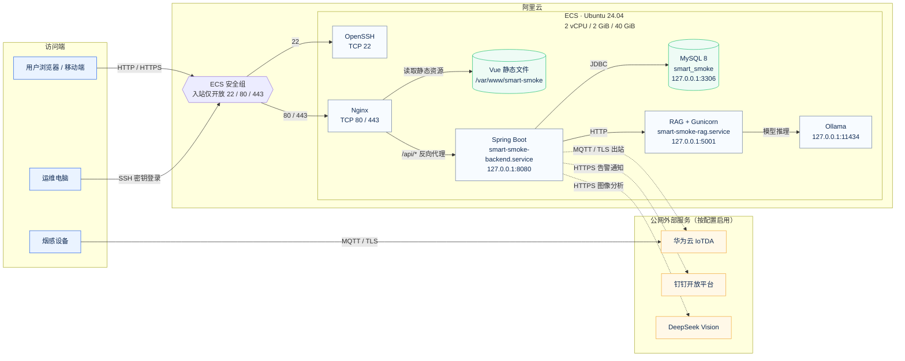
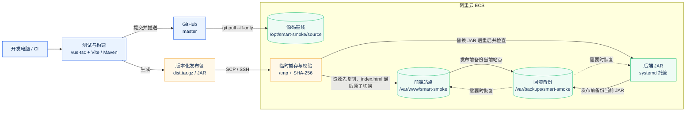

# 部署文档

更新日期：2026-09-03  
适用项目：智慧烟感监测系统  
代码仓库：`https://github.com/kangsky232/easterproject`  
生产分支：`master`

本文参考“前后端分离项目部署图样例及清单”的组织方式，结合本项目已经验证过的阿里云 ECS 实际部署环境编写。内容覆盖部署拓扑、软硬件清单、首次安装、日常发布、配置管理、验收、回滚、备份、安全和故障排查，可作为开发、交付和运维人员的统一操作手册。

> 本仓库是公开代码仓库。文档不保存完整实例 ID、公网 IP、密码、AccessKey、Client Secret、API Key、SSH 私钥或数据库备份。命令中的 `<ECS_PUBLIC_IP>`、`<DOMAIN>`、`<PASSWORD>` 等占位符必须在执行时替换，不能原样运行。

## 阅读导航

- 第 1～4 节：部署目标、当前环境、拓扑和资源清单。
- 第 5～10 节：ECS 初始化、目录、源码、MySQL、后端、RAG 和 Ollama。
- 第 11～18 节：本地构建、发布前检查、前端/后端/RAG 发布与回滚。
- 第 19～23 节：备份恢复、监控、故障排查、验收和常用命令。
- 第 24～28 节：Cloudflare、Docker 备用方案、发布记录、安全边界与参考资料。

## 1. 部署目标与范围

当前阿里云部署采用“单台 ECS、原生进程、Nginx 同源反向代理”方案，不使用 Docker：

- Vue 3 前端在开发电脑或 CI 中完成构建，ECS 只托管 `dist` 静态产物。
- Nginx 是唯一 Web 入口，直接提供前端文件，并把 `/api/` 转发至 Spring Boot。
- Spring Boot 由 systemd 守护，监听 `8080`。
- MySQL 8、RAG 服务和 Ollama 均部署在同一台 ECS，仅允许本机访问。
- RAG Flask 应用由 Gunicorn 和 systemd 守护，监听 `127.0.0.1:5001`。
- GitHub `master` 是服务器源码基线；真实密钥由服务器环境文件提供，不进入 Git。

这套方案适合当前演示、课程交付和小规模试运行。它仍是单机架构，不具备数据库主从、应用多实例、自动故障转移和跨可用区容灾能力。

## 2. 当前环境登记

### 2.1 阿里云 ECS

| 项目 | 当前实际值或约定 |
| --- | --- |
| 实例名称 | `Ubuntu-plvh` |
| 操作系统 | Ubuntu 24.04 LTS，x86_64 |
| 规格 | 2 vCPU、2 GiB 内存、40 GiB ESSD 云盘 |
| 登录用户 | `admin`，使用 SSH 密钥登录 |
| 公网地址 | 以阿里云控制台为准；公开文档使用 `<ECS_PUBLIC_IP>` |
| 内网地址 | 以阿里云控制台为准；当前单机组件使用回环地址通信 |
| 源码目录 | `/opt/smart-smoke/source` |
| 前端站点目录 | `/var/www/smart-smoke` |
| RAG 虚拟环境 | `/opt/smart-smoke/rag-venv` |
| Nginx 站点配置 | `/etc/nginx/sites-enabled/smart-smoke` |
| 后端服务 | `smart-smoke-backend.service` |
| RAG 服务 | `smart-smoke-rag.service` |
| 数据库 | 本机 MySQL 8，数据库名 `smart_smoke` |

### 2.2 已验证的监听关系

| 端口 | 组件 | 监听范围 | 公网策略 |
| --- | --- | --- | --- |
| `22/tcp` | SSH | ECS | 仅允许可信管理 IP，禁止全网长期开放 |
| `80/tcp` | Nginx HTTP | `0.0.0.0` / `[::]` | 当前可用于临时验收；正式上线应跳转 HTTPS |
| `443/tcp` | Nginx HTTPS | 配置证书后启用 | 正式 Web 入口 |
| `8080/tcp` | Spring Boot | 应限制为 `127.0.0.1` | 禁止安全组和防火墙公网放行 |
| `3306/tcp` | MySQL | `127.0.0.1` | 禁止公网放行 |
| `5001/tcp` | RAG Gunicorn | `127.0.0.1` | 禁止公网放行 |
| `11434/tcp` | Ollama | `127.0.0.1` | 禁止公网放行 |

### 2.3 当前部署状态说明

- GitHub 和 ECS 源码通过 `master` 分支同步。
- Nginx、MySQL、Spring Boot、RAG 和 Ollama 已在 ECS 上安装并运行过。
- 前端采用 Nginx 同源 `/api` 代理，因此阿里云版本构建时不设置 `VITE_API_BASE`。
- 另有 Cloudflare Pages 演示入口。Pages 构建需要设置 `VITE_API_BASE=https://api.kangroom.eu.cc`，不能与 ECS 同源构建包混用。
- 2 GiB ECS 在全部业务服务运行时执行 `npm ci` 曾出现整机长时间无响应。因此正式发布固定采用“本地/CI 构建，ECS 只接收成品”的方式。

## 3. 部署拓扑

### 3.1 线上运行拓扑

下图只表示系统运行期间的访问关系。实线是当前核心请求链路，虚线是按配置启用的外部集成；MySQL、RAG、Ollama 和 Spring Boot 的业务端口不经过安全组对公网开放。



这张图需要特别注意三个边界：

- 安全组只允许公网访问 `22`、`80` 和 `443`，其中 `22` 应进一步限制为管理员固定 IP。
- 浏览器永远通过 Nginx 访问系统；浏览器不会直接连接 `8080`、`3306`、`5001` 或 `11434`。
- 外部平台连接均由服务器主动发起，图中使用虚线表示；未配置对应密钥时不影响前端、API 和数据库的基础链路。

### 3.2 GitHub 与发布拓扑

构建和发布链路与运行时请求分开。由于 ECS 只有 2 GiB 内存，前端和后端都优先在开发电脑或 CI 构建，服务器只同步源码、校验发布包并切换产物。



发布图中的前端和后端是两条独立分支：只修改前端时不应重启 Spring Boot；只修改后端时不应覆盖前端目录。每次发布都必须记录 Git 提交号，并在切换前生成可回滚备份。

### 3.3 请求链路

1. 用户访问 ECS 域名或公网 IP。
2. Nginx 对普通路径返回 Vue 静态资源；Vue 路由由 `try_files ... /index.html` 回退处理。
3. 浏览器请求同源 `/api/...`。
4. Nginx 将请求转发到 `http://127.0.0.1:8080`。
5. Spring Boot 访问本机 MySQL，并按需调用 RAG、MQTT、钉钉和 DeepSeek。
6. MySQL、RAG、Ollama 和 Spring Boot 业务端口均不直接暴露公网。

## 4. 资源、软件和部署包清单

### 4.1 资源清单

| 资源 | 数量 | 当前用途 | 备注 |
| --- | ---: | --- | --- |
| 阿里云 ECS | 1 台 | Web、API、数据库、RAG、Ollama | 单点；2 GiB 内存必须控制构建和模型负载 |
| ESSD 云盘 | 40 GiB | 系统、源码、日志和数据库 | 应监控使用率并定期清理构建缓存 |
| 阿里云安全组 | 1 组 | 公网入口控制 | 仅开放 22、80、443；22 限制来源 |
| 域名 | 建议 1 个 | 正式 HTTPS 访问 | 未绑定前只能通过公网 IP 临时验收 |
| TLS 证书 | 建议 1 张 | HTTPS | 可用 Let's Encrypt 或阿里云证书服务 |
| 数据库备份存储 | 至少 1 处 | MySQL 备份 | 不能只保存在同一块 ECS 系统盘 |

### 4.2 软件清单

| 软件 | 项目要求 | 运行用途 |
| --- | --- | --- |
| Ubuntu | 当前 24.04 LTS | 服务器操作系统 |
| Nginx | Ubuntu 仓库稳定版 | 静态资源、SPA 回退、API 反向代理、TLS |
| OpenJDK | 17 或更高 | 运行 Spring Boot JAR |
| MySQL | 8.0 | 业务数据存储 |
| Python | 3.10 或更高 | RAG 服务运行环境 |
| Gunicorn | 与 Flask 兼容的稳定版 | RAG 生产 WSGI 进程 |
| Ollama | 当前稳定版 | RAG 模型调用入口 |
| Git | 当前稳定版 | 同步源码和记录版本 |
| Node.js / npm | Node 18+ | 只在开发电脑或 CI 构建前端；ECS 不建议构建 |
| Maven | 3.9+ | 只在开发电脑或 CI 构建后端；ECS 不建议构建 |

### 4.3 每次发布应准备的内容

| 发布物 | 来源 | 部署位置 |
| --- | --- | --- |
| Git 提交号 | GitHub `master` | 发布记录和回滚依据 |
| 前端 `dist` | `smoke-detector-frontend/dist` | `/var/www/smart-smoke` |
| 后端 JAR | `backend/target/smart-smoke-backend-0.1.0.jar` | `/opt/smart-smoke/source/backend/target/` |
| 数据库迁移脚本 | `docs/migrations/` | 执行后保留审计记录 |
| RAG 源码 | `rag-service/` | `/opt/smart-smoke/source/rag-service` |
| Nginx 配置 | 本文模板或 `deploy/nginx/` | `/etc/nginx/sites-available/smart-smoke` |
| systemd 服务 | 本文模板 | `/etc/systemd/system/` |
| 环境变量文件 | 服务器人工创建 | `/etc/smart-smoke/*.env`，禁止提交 Git |

## 5. 安全组与服务器初始化

### 5.1 阿里云安全组

建议入方向规则：

| 协议端口 | 来源 | 用途 |
| --- | --- | --- |
| TCP 22 | 管理员固定公网 IP `/32` | SSH 运维 |
| TCP 80 | `0.0.0.0/0`、`::/0` | HTTP；配置 TLS 后只用于跳转 HTTPS |
| TCP 443 | `0.0.0.0/0`、`::/0` | HTTPS |

不要添加 3306、5001、8080 或 11434 的公网入方向规则。若这些端口已经开放，应先确认 Nginx 代理正常，再删除公网规则。

### 5.2 SSH 登录

开发电脑使用专用密钥，不使用明文密码：

```powershell
ssh -i <SSH_KEY_PATH> admin@<ECS_PUBLIC_IP>
```

首次连接应人工核对主机指纹。私钥只存放在受保护的本机 SSH 目录，不能上传 GitHub、网盘或聊天窗口。

### 5.3 安装基础软件

```bash
sudo apt update
sudo apt install -y nginx git openjdk-17-jre-headless mysql-server \
  python3 python3-venv python3-pip curl rsync unzip
sudo systemctl enable --now nginx mysql
java -version
mysql --version
nginx -v
git --version
```

如果需要在服务器紧急编译后端，可额外安装 `openjdk-17-jdk maven`；不建议在这台 2 GiB ECS 上安装并运行前端构建链路。

### 5.4 配置交换空间

2 GiB 内存不足以稳定承载全部服务和临时构建任务。建议配置 2 GiB 交换空间作为峰值保护，但交换空间不能替代内存扩容：

```bash
swapon --show
free -h
```

仅在 `swapon --show` 没有现有交换空间时执行：

```bash
sudo fallocate -l 2G /swapfile
sudo chmod 600 /swapfile
sudo mkswap /swapfile
sudo swapon /swapfile
echo '/swapfile none swap sw 0 0' | sudo tee -a /etc/fstab
swapon --show
```

执行前确认系统盘至少剩余 5 GiB。若 `/etc/fstab` 已存在 `/swapfile` 条目，不要重复追加。

## 6. 目录和运行用户

### 6.1 创建目录

```bash
sudo install -d -o admin -g admin -m 0755 /opt/smart-smoke
sudo install -d -o admin -g admin -m 0755 /opt/smart-smoke/source
sudo install -d -o admin -g admin -m 0755 /var/www/smart-smoke
sudo install -d -o root -g root -m 0750 /etc/smart-smoke
sudo install -d -o root -g root -m 0750 /var/backups/smart-smoke
```

### 6.2 创建最小权限服务用户

```bash
id smartsmoke >/dev/null 2>&1 || \
  sudo useradd --system --home /opt/smart-smoke --shell /usr/sbin/nologin smartsmoke
sudo chown -R admin:admin /opt/smart-smoke/source
sudo chown -R admin:admin /var/www/smart-smoke
```

约定：

- `admin` 负责拉取代码和上传发布物。
- `smartsmoke` 只负责运行后端和 RAG，不允许交互登录。
- 环境变量文件归 `root:root` 所有，权限为 `600` 或 `640`。
- Nginx 只需要读取 `/var/www/smart-smoke`。

## 7. 获取源码

首次部署：

```bash
git clone https://github.com/kangsky232/easterproject.git /opt/smart-smoke/source
git -C /opt/smart-smoke/source switch master
git -C /opt/smart-smoke/source status --short --branch
```

日常同步只允许快进，避免在服务器生成未经审核的合并提交：

```bash
git -C /opt/smart-smoke/source fetch origin master
git -C /opt/smart-smoke/source status --short --branch
git -C /opt/smart-smoke/source pull --ff-only origin master
git -C /opt/smart-smoke/source rev-parse HEAD
```

如果 `git status` 显示服务器存在本地修改，应停止发布并先确认修改来源。不要执行 `git reset --hard` 覆盖未知修改。

## 8. MySQL 初始化与迁移

### 8.1 创建数据库和业务账号

进入 MySQL 管理终端：

```bash
sudo mysql
```

执行以下 SQL，并将密码替换为独立强密码：

```sql
CREATE DATABASE IF NOT EXISTS smart_smoke
  CHARACTER SET utf8mb4
  COLLATE utf8mb4_unicode_ci;

CREATE USER IF NOT EXISTS 'smart_smoke_app'@'localhost'
  IDENTIFIED BY '<LONG_RANDOM_DATABASE_PASSWORD>';

GRANT ALL PRIVILEGES ON smart_smoke.*
  TO 'smart_smoke_app'@'localhost';

FLUSH PRIVILEGES;
```

生产后端禁止使用 `root` 或空密码。数据库密码、Root 密码、JWT 密钥和管理员密码必须彼此不同。

### 8.2 全新数据库

```bash
mysql -u smart_smoke_app -p --default-character-set=utf8mb4 \
  smart_smoke < /opt/smart-smoke/source/docs/schema.sql
```

### 8.3 已有数据库升级

升级前先备份。随后按文件名日期顺序执行尚未应用的迁移：

```text
docs/migrations/20260826_decimal_concentration.sql
docs/migrations/20260826_extended_sensor_metrics.sql
docs/migrations/20260828_role_workspace_3d_map.sql
docs/migrations/20260831_hazard_workflow.sql
docs/migrations/20260831_notification_audit.sql
docs/migrations/20260901_vision_patrol.sql
```

执行示例：

```bash
mysql -u smart_smoke_app -p --default-character-set=utf8mb4 \
  smart_smoke < /opt/smart-smoke/source/docs/migrations/<MIGRATION_FILE>.sql
```

迁移脚本必须逐个执行并记录文件名、执行时间、操作者、Git 提交号和结果。不能通过删除表、清空数据库或重新导入开发库完成生产升级。

## 9. 后端运行配置

### 9.1 创建环境文件

创建 `/etc/smart-smoke/backend.env`：

```dotenv
SPRING_PROFILES_ACTIVE=prod
SERVER_PORT=8080
SERVER_ADDRESS=127.0.0.1

DB_URL=jdbc:mysql://127.0.0.1:3306/smart_smoke?useUnicode=true&characterEncoding=utf8&serverTimezone=Asia/Shanghai
DB_USERNAME=smart_smoke_app
DB_PASSWORD=<LONG_RANDOM_DATABASE_PASSWORD>

JWT_SECRET=<AT_LEAST_32_RANDOM_BYTES>
JWT_EXPIRATION=86400000

BOOTSTRAP_ADMIN_ENABLED=false
BOOTSTRAP_ADMIN_USERNAME=
BOOTSTRAP_ADMIN_PASSWORD=
BOOTSTRAP_ADMIN_RESET_PASSWORD=false

# 正式环境填写实际 HTTPS 前端域名，不带末尾斜杠。
CORS_ALLOWED_ORIGINS=https://<DOMAIN>
LOGIN_RATE_LIMIT_ENABLED=false

RAG_SERVICE_URL=http://127.0.0.1:5001/api/chat/query
RAG_HEALTH_URL=http://127.0.0.1:5001/api/health
RAG_TIMEOUT_SECONDS=130
RAG_HEALTH_TIMEOUT_SECONDS=2

MQTT_ENABLED=false
MQTT_BROKER=ssl://<MQTT_HOST>:8883
MQTT_ACCESS_KEY=
MQTT_ACCESS_CODE=
MQTT_INSTANCE_ID=
MQTT_TOPIC=smoke/report
MQTT_SUBSCRIBE_TIMEOUT_MS=10000

DINGTALK_ENABLED=false
DINGTALK_CLIENT_ID=
DINGTALK_CLIENT_SECRET=
DINGTALK_ROBOT_CODE=

VISION_ENABLED=true
DEEPSEEK_API_KEY=
DEEPSEEK_BASE_URL=https://api.deepseek.com
DEEPSEEK_VISION_MODEL=deepseek-v4-flash-vision-exp
VISION_FRAME_BASE_URL=https://<DOMAIN>
VISION_INTERVAL_MS=15000
VISION_INITIAL_DELAY_MS=3000
VISION_TIMEOUT_SECONDS=45
VISION_CONFIDENCE_THRESHOLD=0.65

LOG_FILE=/var/log/smart-smoke/backend.log
```

设置权限：

```bash
sudo install -d -o smartsmoke -g smartsmoke -m 0750 /var/log/smart-smoke
sudo chown root:smartsmoke /etc/smart-smoke/backend.env
sudo chmod 640 /etc/smart-smoke/backend.env
```

注意：

- `prod` Profile 会拒绝弱 JWT、空数据库密码、`root` 数据库用户、示例 CORS 域名、开发来源和管理员密码重置开关。
- 第一次创建管理员时，可临时设置 `BOOTSTRAP_ADMIN_ENABLED=true`，并设置至少 12 位强密码；创建成功后立即改回 `false` 并重启后端。
- `DINGTALK_ROBOT_CODE` 留空时，项目默认使用 Client ID。
- 没有 DeepSeek Key 时，视觉功能会明确进入 `SIMULATION_FALLBACK`，不能在交付材料中描述为真实模型识别。
- 真实凭据不能复制到 `.env.example`、README、截图或工单评论中。

### 9.2 systemd 后端服务

创建 `/etc/systemd/system/smart-smoke-backend.service`：

首次部署时，应先完成第 11 节构建和第 14 节 JAR 上传，确认目标 JAR 存在后再启用服务。已有服务器可直接按下面的服务定义核对配置。

```ini
[Unit]
Description=Smart Smoke Spring Boot Backend
After=network-online.target mysql.service smart-smoke-rag.service
Wants=network-online.target
Requires=mysql.service

[Service]
Type=simple
User=smartsmoke
Group=smartsmoke
WorkingDirectory=/opt/smart-smoke/source/backend
EnvironmentFile=/etc/smart-smoke/backend.env
ExecStart=/usr/bin/java -Xms128m -Xmx512m -XX:MaxMetaspaceSize=192m -XX:+UseSerialGC -jar /opt/smart-smoke/source/backend/target/smart-smoke-backend-0.1.0.jar
Restart=on-failure
RestartSec=5
SuccessExitStatus=143
TimeoutStopSec=30
NoNewPrivileges=true
PrivateTmp=true
ProtectSystem=strict
ProtectHome=true
ReadWritePaths=/var/log/smart-smoke

[Install]
WantedBy=multi-user.target
```

启用并验证：

```bash
sudo systemctl daemon-reload
sudo systemctl enable --now smart-smoke-backend
sudo systemctl status smart-smoke-backend --no-pager
curl --fail --silent --show-error http://127.0.0.1:8080/api/health
```

## 10. RAG 与 Ollama

### 10.1 创建 Python 虚拟环境

```bash
python3 -m venv /opt/smart-smoke/rag-venv
/opt/smart-smoke/rag-venv/bin/pip install --upgrade pip
/opt/smart-smoke/rag-venv/bin/pip install \
  -r /opt/smart-smoke/source/rag-service/requirements.txt gunicorn
```

### 10.2 RAG 环境文件

创建 `/etc/smart-smoke/rag.env`：

```dotenv
OLLAMA_BASE_URL=http://127.0.0.1:11434
OLLAMA_MODEL=gpt-oss:120b-cloud
OLLAMA_TIMEOUT_SECONDS=120
OLLAMA_MAX_TOKENS=768
OLLAMA_KEEP_ALIVE=10m
```

```bash
sudo chown root:smartsmoke /etc/smart-smoke/rag.env
sudo chmod 640 /etc/smart-smoke/rag.env
```

### 10.3 systemd RAG 服务

创建 `/etc/systemd/system/smart-smoke-rag.service`：

```ini
[Unit]
Description=Smart Smoke RAG Service
After=network-online.target ollama.service
Wants=network-online.target

[Service]
Type=simple
User=smartsmoke
Group=smartsmoke
WorkingDirectory=/opt/smart-smoke/source/rag-service
EnvironmentFile=/etc/smart-smoke/rag.env
ExecStart=/opt/smart-smoke/rag-venv/bin/gunicorn --bind 127.0.0.1:5001 --workers 1 --threads 2 --timeout 130 app:app
Restart=on-failure
RestartSec=5
TimeoutStopSec=30
NoNewPrivileges=true
PrivateTmp=true
ProtectSystem=strict
ProtectHome=true

[Install]
WantedBy=multi-user.target
```

启用并验证：

```bash
sudo systemctl daemon-reload
sudo systemctl enable --now smart-smoke-rag
sudo systemctl status smart-smoke-rag --no-pager
curl --fail --silent --show-error http://127.0.0.1:5001/api/health
```

### 10.4 Ollama 检查

```bash
sudo systemctl status ollama --no-pager
curl --fail --silent --show-error http://127.0.0.1:11434/api/tags
ollama list
```

`gpt-oss:120b-cloud` 是云模型入口，不应在 2 GiB ECS 上尝试加载 120B 本地权重。模型、账号或外网不可用时，系统会使用本地安全知识规则降级；验收记录必须如实写明返回的能力状态。

## 11. 在开发电脑构建发布物

所有构建先在开发电脑完成。只有构建和测试全部通过，才允许操作 ECS。

### 11.1 获取最新代码

```powershell
git switch master
git pull --ff-only origin master
git status --short --branch
git log -1 --oneline
```

工作区必须无意外修改。发布记录中保存 `git rev-parse HEAD` 的完整提交号。

### 11.2 构建前端

阿里云部署采用同源 `/api`，必须确保当前 PowerShell 进程没有 `VITE_API_BASE`：

```powershell
Set-Location smoke-detector-frontend
Remove-Item Env:VITE_API_BASE -ErrorAction SilentlyContinue
npm.cmd ci
npm.cmd run build
Set-Location ..
```

构建会先运行 `vue-tsc --noEmit`，再由 Vite 生成 `smoke-detector-frontend/dist`。检查入口文件：

```powershell
Get-Content -Encoding UTF8 smoke-detector-frontend/dist/index.html
```

构建后的 JavaScript 不应写入 `localhost:8080`，也不应写入 Cloudflare API 域名。ECS 前端只请求同源 `/api`。

### 11.3 构建后端

仅前端代码变化时可以跳过本节。后端变化时执行：

```powershell
mvn.cmd -f backend/pom.xml clean package
```

成功后应生成：

```text
backend/target/smart-smoke-backend-0.1.0.jar
```

禁止使用 `-DskipTests` 生成正式发布包，除非故障修复流程已有单独的测试证据和审批记录。

### 11.4 生成前端压缩包和校验值

```powershell
$releaseCommit = git rev-parse --short=12 HEAD
$frontendPackage = Join-Path $env:TEMP "smart-smoke-frontend-$releaseCommit.tar.gz"
tar -C smoke-detector-frontend/dist -czf $frontendPackage .
Get-FileHash -Algorithm SHA256 $frontendPackage
```

后端有变化时同时计算 JAR 校验值：

```powershell
Get-FileHash -Algorithm SHA256 backend/target/smart-smoke-backend-0.1.0.jar
```

## 12. 发布前检查

发布人必须确认：

- GitHub `master` 已包含目标提交。
- 本地工作区没有未提交的机密文件。
- 前端构建通过；涉及后端时 Maven 测试和打包通过。
- 已记录旧版本 Git 提交号和当前网页 JS 哈希。
- 数据库变更已经过评审，并已完成备份。
- ECS 的 SSH、磁盘、内存、Nginx 和后端健康状态正常。
- 当前没有未完成的高风险告警处置或数据库维护操作。
- 发布窗口允许短暂重启后端；仅前端发布不需要重启后端。

ECS 检查命令：

```bash
uptime
free -h
swapon --show
df -h /
git -C /opt/smart-smoke/source status --short --branch
systemctl is-active nginx mysql smart-smoke-rag smart-smoke-backend
curl --fail --silent --show-error http://127.0.0.1:8080/api/health
```

如果负载持续过高、可用内存接近 0、系统正在大量交换或磁盘使用率超过 85%，应先处理资源问题，不要开始发布。

## 13. 前端发布

### 13.1 上传构建包

开发电脑执行：

```powershell
$releaseCommit = git rev-parse --short=12 HEAD
$frontendPackage = Join-Path $env:TEMP "smart-smoke-frontend-$releaseCommit.tar.gz"
scp -i <SSH_KEY_PATH> $frontendPackage admin@<ECS_PUBLIC_IP>:/tmp/
```

### 13.2 在 ECS 解包并校验

```bash
RELEASE_COMMIT='<12位提交号>'
PACKAGE="/tmp/smart-smoke-frontend-${RELEASE_COMMIT}.tar.gz"
STAGING="/tmp/smart-smoke-frontend-${RELEASE_COMMIT}"

rm -rf "$STAGING"
mkdir -p "$STAGING"
tar -xzf "$PACKAGE" -C "$STAGING"
test -s "$STAGING/index.html"
test -d "$STAGING/assets"
grep -Eo 'assets/index-[A-Za-z0-9_-]+\.js' "$STAGING/index.html"
```

这里只允许删除 `/tmp/smart-smoke-frontend-<提交号>` 暂存目录，不能把变量留空，也不能对 `/var/www`、`/opt` 或根目录执行递归删除。

### 13.3 先复制哈希资源，再原子切换入口

前端资源名带内容哈希。先复制新资源，最后替换 `index.html`，可避免入口引用尚未上传的文件：

```bash
RELEASE_COMMIT='<12位提交号>'
STAGING="/tmp/smart-smoke-frontend-${RELEASE_COMMIT}"
STAMP="$(date +%Y%m%d-%H%M%S)"

sudo cp /var/www/smart-smoke/index.html \
  "/var/www/smart-smoke/index.html.rollback-${STAMP}"

sudo rsync -a --exclude='index.html' \
  "$STAGING/" /var/www/smart-smoke/

sudo install -o admin -g admin -m 0644 \
  "$STAGING/index.html" /var/www/smart-smoke/index.html.new

sudo mv /var/www/smart-smoke/index.html.new \
  /var/www/smart-smoke/index.html

sudo nginx -t
sudo systemctl reload nginx
```

本流程不立即删除旧哈希资源，使旧标签页和快速回滚仍能加载旧文件。磁盘清理由独立维护窗口执行。

### 13.4 前端发布验证

```bash
curl --fail --silent --show-error http://127.0.0.1/ \
  | grep -Eo 'assets/index-[A-Za-z0-9_-]+\.(js|css)'

curl --fail --silent --show-error http://127.0.0.1/api/health
```

开发电脑验证公网：

```powershell
curl.exe --fail --silent --show-error http://<ECS_PUBLIC_IP>/
curl.exe --fail --silent --show-error http://<ECS_PUBLIC_IP>/api/health
```

正式域名启用后，把 HTTP 地址替换为 `https://<DOMAIN>`。

## 14. 后端发布

仅在 Java 代码、资源文件或依赖发生变化时执行。本次如果只有 Vue 文件变化，不应重启后端。

### 14.1 上传 JAR

开发电脑执行：

```powershell
$releaseCommit = git rev-parse --short=12 HEAD
scp -i <SSH_KEY_PATH> backend/target/smart-smoke-backend-0.1.0.jar "admin@<ECS_PUBLIC_IP>:/tmp/smart-smoke-backend-$releaseCommit.jar"
```

### 14.2 数据库备份与迁移

如果版本包含 `docs/migrations/` 新文件，先执行第 19 节的数据库备份，再逐个执行迁移。迁移成功后才切换 JAR。

后端启动器会兼容补齐部分功能表，但这不能替代显式迁移记录。正式发布应以 SQL 脚本执行结果作为审计依据。

### 14.3 原子替换 JAR

ECS 执行：

```bash
RELEASE_COMMIT='<12位提交号>'
TARGET='/opt/smart-smoke/source/backend/target/smart-smoke-backend-0.1.0.jar'
NEW_JAR="/tmp/smart-smoke-backend-${RELEASE_COMMIT}.jar"
BACKUP="${TARGET}.rollback-$(date +%Y%m%d-%H%M%S)"

test -s "$NEW_JAR"
sudo cp "$TARGET" "$BACKUP"
sudo install -o admin -g admin -m 0644 "$NEW_JAR" "${TARGET}.new"
sudo systemctl stop smart-smoke-backend
sudo mv "${TARGET}.new" "$TARGET"
sudo systemctl start smart-smoke-backend
sudo systemctl status smart-smoke-backend --no-pager
```

等待后端启动并检查：

```bash
for attempt in 1 2 3 4 5 6; do
  if curl --fail --silent http://127.0.0.1:8080/api/health; then
    break
  fi
  sleep 5
done

curl --fail --silent --show-error \
  http://127.0.0.1:8080/api/system/capabilities
```

### 14.4 后端发布失败回滚

若新版本无法启动：

```bash
sudo journalctl -u smart-smoke-backend -n 200 --no-pager
sudo systemctl stop smart-smoke-backend
sudo cp '<上一版本JAR备份路径>' \
  /opt/smart-smoke/source/backend/target/smart-smoke-backend-0.1.0.jar
sudo systemctl start smart-smoke-backend
curl --fail --silent --show-error http://127.0.0.1:8080/api/health
```

如果新版本已经执行不可逆数据库迁移，不能只回滚 JAR。必须按照迁移评审中预先制定的兼容策略处理，禁止临时删表或删列。

## 15. RAG 发布

仅在 `rag-service/` 或其依赖变化时执行：

```bash
git -C /opt/smart-smoke/source pull --ff-only origin master
/opt/smart-smoke/rag-venv/bin/pip install \
  -r /opt/smart-smoke/source/rag-service/requirements.txt gunicorn
sudo systemctl restart smart-smoke-rag
sudo systemctl status smart-smoke-rag --no-pager
curl --fail --silent --show-error http://127.0.0.1:5001/api/health
```

随后检查后端对 RAG 的探测结果：

```bash
curl --fail --silent --show-error \
  http://127.0.0.1:8080/api/system/capabilities
```

不要把“RAG 健康接口可访问”等同于“Ollama 一定能够完成推理”。至少再从页面发起一次安全领域问题，确认模型调用或本地安全规则降级符合预期。

## 16. Nginx 配置

### 16.1 当前 HTTP 配置

创建 `/etc/nginx/sites-available/smart-smoke`：

```nginx
server {
    listen 80 default_server;
    listen [::]:80 default_server;
    server_name _;

    root /var/www/smart-smoke;
    index index.html;
    charset utf-8;
    server_tokens off;
    client_max_body_size 2m;

    add_header X-Content-Type-Options "nosniff" always;
    add_header X-Frame-Options "DENY" always;
    add_header Referrer-Policy "strict-origin-when-cross-origin" always;

    location = /index.html {
        expires -1;
        try_files $uri =404;
    }

    location /api/ {
        proxy_pass http://127.0.0.1:8080;
        proxy_http_version 1.1;
        proxy_set_header Host $host;
        proxy_set_header X-Real-IP $remote_addr;
        proxy_set_header X-Forwarded-For $proxy_add_x_forwarded_for;
        proxy_set_header X-Forwarded-Proto $scheme;
        proxy_connect_timeout 5s;
        proxy_send_timeout 150s;
        proxy_read_timeout 150s;
    }

    location ~* \.(?:css|js|png|jpg|jpeg|gif|svg|ico|webp)$ {
        expires 7d;
        try_files $uri =404;
    }

    location / {
        try_files $uri $uri/ /index.html;
    }
}
```

启用配置：

```bash
sudo ln -sfn /etc/nginx/sites-available/smart-smoke \
  /etc/nginx/sites-enabled/smart-smoke
sudo rm -f /etc/nginx/sites-enabled/default
sudo nginx -t
sudo systemctl reload nginx
```

### 16.2 域名和 HTTPS

1. 在 DNS 控制台创建 A 记录，将 `<DOMAIN>` 指向 ECS 公网 IP。
2. 确认阿里云安全组开放 80 和 443。
3. 等待 DNS 生效后验证：

```bash
getent hosts <DOMAIN>
curl -I http://<DOMAIN>
```

安装 Certbot 并申请证书：

```bash
sudo apt install -y certbot python3-certbot-nginx
sudo certbot --nginx -d <DOMAIN>
sudo certbot renew --dry-run
```

推荐的 HTTPS 结构如下；证书路径以 Certbot 实际生成结果为准：

```nginx
server {
    listen 80;
    listen [::]:80;
    server_name <DOMAIN>;
    return 301 https://$host$request_uri;
}

server {
    listen 443 ssl http2;
    listen [::]:443 ssl http2;
    server_name <DOMAIN>;

    ssl_certificate /etc/letsencrypt/live/<DOMAIN>/fullchain.pem;
    ssl_certificate_key /etc/letsencrypt/live/<DOMAIN>/privkey.pem;
    ssl_protocols TLSv1.2 TLSv1.3;

    root /var/www/smart-smoke;
    index index.html;
    charset utf-8;
    server_tokens off;
    client_max_body_size 2m;

    add_header Strict-Transport-Security "max-age=31536000; includeSubDomains" always;
    add_header X-Content-Type-Options "nosniff" always;
    add_header X-Frame-Options "DENY" always;
    add_header Referrer-Policy "strict-origin-when-cross-origin" always;

    location = /index.html {
        expires -1;
        try_files $uri =404;
    }

    location /api/ {
        proxy_pass http://127.0.0.1:8080;
        proxy_http_version 1.1;
        proxy_set_header Host $host;
        proxy_set_header X-Real-IP $remote_addr;
        proxy_set_header X-Forwarded-For $proxy_add_x_forwarded_for;
        proxy_set_header X-Forwarded-Proto https;
        proxy_connect_timeout 5s;
        proxy_send_timeout 150s;
        proxy_read_timeout 150s;
    }

    location ~* \.(?:css|js|png|jpg|jpeg|gif|svg|ico|webp)$ {
        expires 7d;
        try_files $uri =404;
    }

    location / {
        try_files $uri $uri/ /index.html;
    }
}
```

确认 HTTPS 正常后，把 `/etc/smart-smoke/backend.env` 中的 `CORS_ALLOWED_ORIGINS` 和 `VISION_FRAME_BASE_URL` 改为正式域名，再重启后端。不要在 HTTPS 页面中调用 HTTP API，否则浏览器会阻止混合内容。

## 17. 标准日常发布流程

### 17.1 仅前端变化

1. 本地 `git pull --ff-only`。
2. 本地执行 `npm ci` 和 `npm run build`。
3. 记录 Git 提交号和压缩包 SHA-256。
4. 检查 ECS 健康、内存和磁盘。
5. ECS 源码执行 `git pull --ff-only`，只用于保持源码版本一致。
6. 上传前端压缩包。
7. 先复制哈希资源，最后原子替换 `index.html`。
8. 执行本机和公网健康检查。
9. 浏览器强制刷新并完成关键页面冒烟测试。

不重启 MySQL、后端、RAG 或 Ollama。

### 17.2 包含后端变化

1. 完成本地 Maven 测试和打包。
2. 识别数据库迁移并提前备份。
3. 上传 JAR，但不立即覆盖运行文件。
4. 执行数据库迁移。
5. 短暂停止后端，原子替换 JAR，再启动服务。
6. 验证 `/api/health` 和 `/api/system/capabilities`。
7. 完成登录、设备、告警和角色权限冒烟测试。
8. 观察日志至少 10 分钟，再结束发布窗口。

### 17.3 包含 RAG 变化

在后端流程之外增加：更新虚拟环境依赖、重启 `smart-smoke-rag`、检查 RAG 健康并执行一次真实问答。不要因为 RAG 失败而误判数据库或烟感主链路失败；应用应按设计降级。

## 18. 回滚

### 18.1 前端回滚

发布前保存的 `index.html.rollback-<时间>` 仍引用旧哈希资源，而旧资源没有立即删除。回滚时执行：

```bash
sudo cp /var/www/smart-smoke/index.html \
  /var/www/smart-smoke/index.html.failed
sudo cp '<目标index.html.rollback文件>' \
  /var/www/smart-smoke/index.html.new
sudo mv /var/www/smart-smoke/index.html.new \
  /var/www/smart-smoke/index.html
sudo nginx -t
sudo systemctl reload nginx
```

随后检查入口中的 JS/CSS 哈希并强制刷新浏览器。

### 18.2 后端回滚

使用第 14.4 节的 JAR 备份回滚。回滚前必须确认旧 JAR 与当前数据库结构兼容。

### 18.3 源码回滚原则

- 生产源码目录用于记录当前版本，不用于直接编辑。
- 需要回退代码时，应在开发电脑创建正常的 Git revert 提交并推送 GitHub，再让服务器快进到该提交。
- 不使用 `git reset --hard` 覆盖未知服务器改动。
- 不使用强制推送重写共享 `master` 历史。

## 19. 数据库备份与恢复

### 19.1 备份凭据

为备份任务创建仅供 Root 读取的 `/root/.my.cnf`：

```ini
[client]
user=smart_smoke_app
password=<LONG_RANDOM_DATABASE_PASSWORD>
host=127.0.0.1
default-character-set=utf8mb4
```

```bash
sudo chown root:root /root/.my.cnf
sudo chmod 600 /root/.my.cnf
```

这样可以避免把数据库密码写在命令参数、Shell 历史或进程列表中。

### 19.2 手工备份

```bash
sudo install -d -o root -g root -m 0700 /var/backups/smart-smoke
sudo sh -c 'mysqldump --defaults-extra-file=/root/.my.cnf \
  --single-transaction --routines --triggers --events smart_smoke \
  | gzip > /var/backups/smart-smoke/smart_smoke-$(date +%Y%m%d-%H%M%S).sql.gz'
sudo ls -lh /var/backups/smart-smoke
```

备份完成后检查压缩文件不是 0 字节，并把副本同步到阿里云 OSS、另一台服务器或其他独立存储。只保存在 ECS 系统盘上的备份无法应对磁盘和实例级故障。

### 19.3 定时备份

创建 `/usr/local/sbin/backup-smart-smoke`：

```bash
#!/usr/bin/env bash
set -euo pipefail

BACKUP_DIR=/var/backups/smart-smoke
STAMP=$(date +%Y%m%d-%H%M%S)
install -d -o root -g root -m 0700 "$BACKUP_DIR"
mysqldump --defaults-extra-file=/root/.my.cnf \
  --single-transaction --routines --triggers --events smart_smoke \
  | gzip > "$BACKUP_DIR/smart_smoke-$STAMP.sql.gz"
find "$BACKUP_DIR" -maxdepth 1 -type f \
  -name 'smart_smoke-*.sql.gz' -mtime +14 -delete
```

```bash
sudo chown root:root /usr/local/sbin/backup-smart-smoke
sudo chmod 700 /usr/local/sbin/backup-smart-smoke
```

创建 `/etc/systemd/system/smart-smoke-backup.service`：

```ini
[Unit]
Description=Back up Smart Smoke MySQL database
After=mysql.service

[Service]
Type=oneshot
ExecStart=/usr/local/sbin/backup-smart-smoke
```

创建 `/etc/systemd/system/smart-smoke-backup.timer`：

```ini
[Unit]
Description=Daily Smart Smoke database backup

[Timer]
OnCalendar=*-*-* 03:20:00
Persistent=true
RandomizedDelaySec=10m

[Install]
WantedBy=timers.target
```

```bash
sudo systemctl daemon-reload
sudo systemctl enable --now smart-smoke-backup.timer
sudo systemctl list-timers smart-smoke-backup.timer --no-pager
```

### 19.4 恢复演练

恢复前先停止写入或进入维护窗口。建议先导入临时数据库验证，而不是直接覆盖生产库：

```bash
sudo mysql -e "CREATE DATABASE smart_smoke_restore_test CHARACTER SET utf8mb4 COLLATE utf8mb4_unicode_ci;"
sudo sh -c "gzip -dc '<备份文件.sql.gz>' | mysql --defaults-extra-file=/root/.my.cnf smart_smoke_restore_test"
sudo mysql -e "SHOW TABLES FROM smart_smoke_restore_test;"
```

核对表数量、关键记录和字符编码后再制定正式恢复窗口。演练结束清理临时库前必须再次确认库名，不能误删 `smart_smoke`。

## 20. 日志、监控与日常检查

### 20.1 服务状态

```bash
systemctl status nginx mysql smart-smoke-rag smart-smoke-backend --no-pager
systemctl is-enabled nginx mysql smart-smoke-rag smart-smoke-backend
```

### 20.2 日志查看

```bash
sudo journalctl -u smart-smoke-backend -n 200 --no-pager
sudo journalctl -u smart-smoke-rag -n 200 --no-pager
sudo journalctl -u nginx -n 100 --no-pager
sudo tail -n 200 /var/log/nginx/error.log
sudo tail -n 200 /var/log/smart-smoke/backend.log
```

持续观察时使用 `journalctl -f`，结束后按 `Ctrl+C`，不要让无人值守终端无限占用连接。

### 20.3 资源检查

```bash
uptime
free -h
swapon --show
df -h
df -i
ps -eo pid,user,pcpu,pmem,rss,etime,args --sort=-pmem | head -20
sudo du -xhd1 /opt /var/log /var/lib/mysql 2>/dev/null
```

建议告警阈值：

| 指标 | 预警 | 严重 |
| --- | ---: | ---: |
| 系统盘使用率 | 75% | 85% |
| inode 使用率 | 75% | 90% |
| 连续 5 分钟可用内存 | 小于 300 MiB | 小于 150 MiB |
| Swap 持续增长 | 观察 | 伴随高 IO 或服务超时 |
| API 健康检查失败 | 1 次重试 | 连续 3 次 |
| Nginx 5xx 比例 | 1% | 5% |

### 20.4 后端日志轮转

创建 `/etc/logrotate.d/smart-smoke`：

```text
/var/log/smart-smoke/*.log {
    daily
    rotate 14
    compress
    delaycompress
    missingok
    notifempty
    copytruncate
}
```

测试配置：

```bash
sudo logrotate --debug /etc/logrotate.d/smart-smoke
```

## 21. 故障排查

### 21.1 排查顺序

1. 检查 ECS 控制台实例是否运行，CPU、内存、磁盘 IO 是否异常。
2. 检查安全组是否允许管理 IP 访问 22，以及公网访问 80/443。
3. 登录 ECS，检查负载、磁盘和 systemd 服务。
4. 从 ECS 本机依次检查 MySQL、RAG、后端、Nginx。
5. 最后检查公网域名、DNS、TLS 和浏览器缓存。

### 21.2 常见问题表

| 现象 | 主要原因 | 检查和处理 |
| --- | --- | --- |
| 22、80 端口能连接，但 SSH banner 和 HTTP 都超时 | 内存耗尽、严重交换、磁盘 IO 饱和或进程风暴 | 从阿里云控制台查看监控；必要时普通重启；恢复后查上一启动日志；禁止继续在 ECS 构建 |
| SSH `Permission denied` | 用户名、私钥或 `authorized_keys` 不匹配 | 确认用户为 `admin`，使用专用密钥和 `IdentitiesOnly=yes` |
| 网页 404 | Nginx 根目录错误或 `dist` 未上传 | 检查 `/var/www/smart-smoke/index.html` 和 `root` 配置 |
| 刷新 Vue 子页面 404 | 缺少 SPA 回退 | `location /` 使用 `try_files $uri $uri/ /index.html` |
| 页面仍是旧版本 | `index.html` 缓存或入口未切换 | 检查入口 JS 哈希，设置 index 不缓存，浏览器 `Ctrl+F5` |
| 静态 JS/CSS 404 | 先替换 index、后上传资源，或误删旧资源 | 恢复旧 index；重新按“资源优先、入口最后”发布 |
| `/api` 返回 502 | 后端未启动或 Nginx 代理地址错误 | 检查 8080、后端 journal 和 `proxy_pass` |
| `/api` 请求超时 | RAG/外部 API 调用较慢，代理超时太短 | 健康接口与业务接口分别检查；Nginx read timeout 设为 150 秒 |
| 后端启动失败 | prod 环境变量不完整 | 查看后端日志；检查 JWT、数据库账号密码、CORS 和管理员开关 |
| MySQL 连接失败 | 服务停止、密码错误或权限不足 | `systemctl status mysql`；用业务账号本机登录验证 |
| RAG 显示不可用 | Gunicorn、Ollama 或模型连接失败 | 分别检查 5001、11434 和 RAG journal；允许安全规则降级 |
| DeepSeek 返回错误 | Key、模型权限、额度、外网或图片地址失败 | 检查能力接口和后端日志；失败帧不会生成真实告警 |
| MQTT 未连接 | Broker、TLS、Topic 或凭据错误 | 检查 `MQTT_*` 和出站网络；不能仅凭进程存活判定设备在线 |
| 钉钉无消息 | 应用凭据、机器人权限或收件人未绑定 | 检查通道状态；接收人需先私聊机器人完成绑定 |
| 磁盘快速增长 | 日志、MySQL、旧构建或备份未轮转 | `du` 定位；先备份再按保留策略清理 |

### 21.3 本次 2 GiB 实例无响应的专用处理

已观察到在 Java、MySQL、RAG、Ollama 和 Nginx 同时运行时，在 ECS 执行 `npm ci` 后出现：

- TCP 22 和 80 可以建立连接；
- SSH 在 banner 阶段超时；
- Nginx 接受连接但不返回 HTTP 内容；
- 已有网页目录尚未替换。

这通常是内存/交换或 IO 资源枯竭的表现，但必须通过恢复后的日志确认：

```bash
sudo journalctl -k -b -1 --no-pager \
  | grep -Ei 'oom|out of memory|killed process|hung task|blocked for more than'
sudo journalctl -b -1 -p warning --no-pager | tail -200
```

处置原则：

1. 在阿里云控制台执行普通重启，不执行重置系统盘。
2. 恢复后先验证 MySQL、后端和 Nginx，不立即重跑 npm。
3. 后续前端只在本地或 CI 构建，然后上传 `dist` 成品。
4. 配置交换空间并评估把实例升级到至少 4 GiB 内存。
5. 如必须在 ECS 临时构建，应先进入维护窗口并停止非核心的 Ollama/RAG，但仍不推荐。

## 22. 上线验收清单

### 22.1 基础设施

- [ ] ECS 状态正常，系统时间和时区符合要求。
- [ ] 22 端口仅对可信管理 IP 开放。
- [ ] 80/443 可访问，3306/5001/8080/11434 无法从公网直连。
- [ ] 磁盘低于 75%，内存和 Swap 无持续异常。
- [ ] Nginx、MySQL、后端、RAG 已设置开机自启。
- [ ] TLS 证书有效，HTTP 自动跳转 HTTPS。

### 22.2 应用和接口

- [ ] 首页可打开，静态 JS/CSS/图片无 404。
- [ ] 刷新任意前端路由不会返回 Nginx 404。
- [ ] `/api/health` 返回 `status=UP`、`database=UP`。
- [ ] `/api/system/capabilities` 与实际 MQTT、RAG、钉钉和视觉配置一致。
- [ ] 系统管理员能够登录，首页、数据总览、社区三维态势、隐患管理、通知审计和用户管理可访问。
- [ ] 不同角色的导航、按钮和后端权限符合预期。
- [ ] 设备列表、实时趋势和 24 小时/7 天/30 天趋势可加载。
- [ ] 3D 地图楼栋、楼层、设备位置和模拟画面可加载。
- [ ] 视觉巡检可启动和暂停，模型或降级来源标记准确。
- [ ] 钉钉绑定用户能收到一次测试广播或新告警。
- [ ] 智能问答能返回模型结果或明确的安全降级结果。

### 22.3 数据与运维

- [ ] 数据库迁移清单已记录，没有遗漏或重复破坏性执行。
- [ ] 数据库备份文件非空，并已复制到 ECS 之外。
- [ ] 完成至少一次临时数据库恢复演练。
- [ ] 后端、RAG、Nginx 日志可读取且已配置轮转。
- [ ] 发布记录包含 Git 提交号、时间、人员、包校验值、验证结果和回滚点。
- [ ] 真实密钥没有出现在 Git、构建产物、截图或日志中。

## 23. 快速运维命令

```bash
# 版本
git -C /opt/smart-smoke/source rev-parse HEAD
git -C /opt/smart-smoke/source status --short --branch

# 服务
systemctl is-active nginx mysql smart-smoke-rag smart-smoke-backend
sudo systemctl restart smart-smoke-backend
sudo systemctl restart smart-smoke-rag
sudo systemctl reload nginx

# 健康
curl --fail http://127.0.0.1/api/health
curl --fail http://127.0.0.1:8080/api/health
curl --fail http://127.0.0.1:5001/api/health

# 日志
sudo journalctl -u smart-smoke-backend -n 200 --no-pager
sudo journalctl -u smart-smoke-rag -n 200 --no-pager
sudo tail -n 200 /var/log/nginx/error.log

# 资源
uptime
free -h
swapon --show
df -h /
```

## 24. Cloudflare Pages 演示环境

阿里云同源部署是本文主线。现有 Cloudflare Pages 可作为独立演示入口或临时备用前端：

| 配置项 | 值 |
| --- | --- |
| 生产分支 | `master` |
| 根目录 | `smoke-detector-frontend` |
| 构建命令 | `npm run build` |
| 输出目录 | `dist` |
| 构建变量 | `VITE_API_BASE=https://api.kangroom.eu.cc` |

关键区别：

- Cloudflare Pages 与 API 跨域，必须在构建时设置 `VITE_API_BASE`。
- 阿里云 Nginx 同源代理 `/api`，构建时必须删除 `VITE_API_BASE`。
- 两种构建产物不可互换。
- Pages 的后端域名和 CORS 说明见 [CLOUDFLARE_PAGES.md](CLOUDFLARE_PAGES.md)。

## 25. Docker Compose 备用方案

仓库仍保留 `docker-compose.yml`、前后端 Dockerfile 和宿主机 HTTPS 模板，但当前 ECS 未安装 Docker，实际运行方式是 systemd + Nginx + 本机 MySQL。除非安排完整迁移窗口，不要在同一台服务器上同时启动 Compose 和现有原生服务，否则会产生端口、数据库和数据目录冲突。

如未来迁移到 Docker，应先在新实例验证：

```bash
cp .env.example .env
# 替换所有 REPLACE_*，真实 .env 不提交 Git。
docker compose --env-file .env config
docker compose --env-file .env up -d --build
```

迁移前必须完成 MySQL 备份与恢复演练、域名切换方案、端口检查、卷备份和回滚预案。对当前 2 GiB ECS，不建议在原生服务旁边直接构建整套 Compose 镜像。

## 26. 发布记录模板

```text
发布日期：
发布人员：
Git 完整提交号：
发布范围：前端 / 后端 / RAG / 数据库 / Nginx
前端包 SHA-256：
后端 JAR SHA-256：
数据库备份文件：
执行的迁移脚本：
发布前版本：
发布后版本：
健康检查结果：
功能冒烟结果：
日志观察结果：
回滚点：
遗留问题：
```

## 27. 安全与能力边界

- 当前单机部署不等于高可用生产系统；ECS、系统盘或本机 MySQL 故障都会影响全部业务。
- 模拟视觉图片和 AI 结论只用于演示与人工辅助，不能替代认证消防设备、现场核验或 119 报警。
- APP 通知和短信仍可能是模拟或待集成能力；必须以运行能力接口和真实端到端测试为准。
- MQTT Broker 已连接不代表实体设备在线；应检查设备最后心跳和最新遥测时间。
- 任何真实密钥泄露到聊天、截图、日志或 Git 后，都必须立即在供应商平台轮换。
- 至少每季度执行一次备份恢复、账号权限、证书续期和故障回滚演练。

## 28. 参考资料

- [前后端分离项目部署图样例及清单](https://www.doubao.com/thread/xSMASB1FwN5Xkj62i)：本文参考其拓扑、清单、步骤、验收和排错结构，并以本项目实际组件与路径重写。
- [项目发布包运行说明](RELEASE_PACKAGE.md)
- [Cloudflare Pages 与本机后端联调](CLOUDFLARE_PAGES.md)
- [API 文档](API.md)
- [前端接口约定](FRONTEND_API.md)
- [功能完成状态](PROJECT_STATUS.md)
